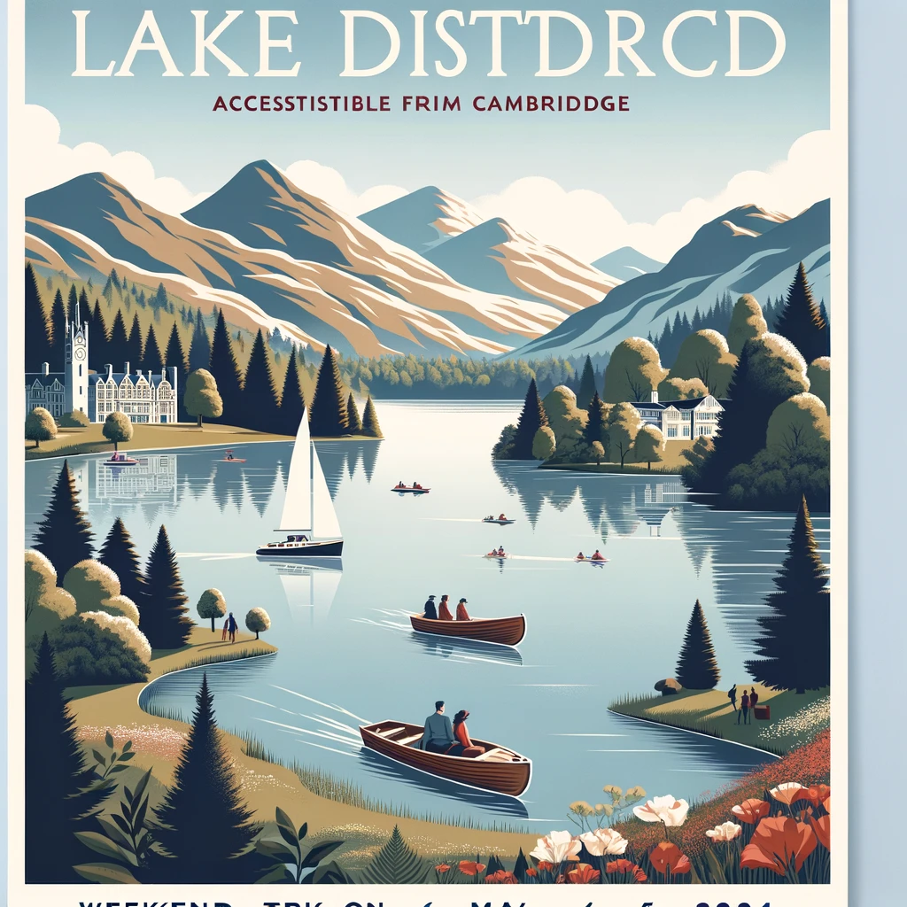

### Trip Option 1: Brighton
**Dates:** May 4-6, 2024

**Itinerary:**
- **Day 1:** Arrive in Brighton, check-in. Visit the Royal Pavilion and explore the Brighton Museum and Art Gallery. Dinner on the seafront.
- **Day 2:** Spend the day at Brighton Beach and Brighton Pier. Enjoy the arcade games, and don’t miss the fish and chips. Evening walk through The Lanes for shopping and local pubs.
- **Day 3:** Visit the Brighton Dome for a morning show or event, then brunch in the city center before heading back.

**Elevator Pitch:** Brighton offers a vibrant blend of beachfront fun, historic architecture, and a lively arts scene. Perfect for a dynamic couple looking to mix relaxation with cultural exploration. The city's energetic vibe and iconic pier are ideal for an unforgettable weekend.

### Trip Option 2: Jurassic Coast (via Southampton)
**Dates:** May 4-6, 2024

**Itinerary:**
- **Day 1:** Train to Southampton, then drive to Jurassic Coast. Visit the SeaCity Museum in Southampton before heading out.
- **Day 2:** Full day exploring the Jurassic Coast. Start with Durdle Door and then hike to Lulworth Cove. Check out the fossil shops in Charmouth.
- **Day 3:** Morning visit to the ancient cliffs at Lyme Regis before taking the train back from Southampton.

**Elevator Pitch:** Explore the dramatic beauty of the Jurassic Coast, a UNESCO World Heritage site known for its stunning geological formations and fossil-studded cliffs. Ideal for adventurous spirits looking to step back in time and wander through landscapes that tell stories millions of years old.

### Trip Option 3: Lake District (accessible via train from Cambridge)
**Dates:** May 4-6, 2024

**Itinerary:**
- **Day 1:** Train to Windermere from Cambridge. Visit the Windermere Jetty Museum and take a late afternoon boat cruise on Lake Windermere.
- **Day 2:** Full day of hiking in the Lake District National Park, possibly the Langdale Pikes or around Grasmere.
- **Day 3:** Explore Ambleside or another nearby village for local crafts and foods before heading back.

**Elevator Pitch:** The Lake District offers breathtaking landscapes and serene waterways, perfect for couples who enjoy nature and picturesque hikes. The calming waters of Lake Windermere and the rugged peaks nearby provide a tranquil escape from the urban rush, ideal for a romantic and rejuvenating weekend.

Each option is structured to maximize the experience in a short time, blending iconic sights with unique local experiences, ensuring a memorable trip.

